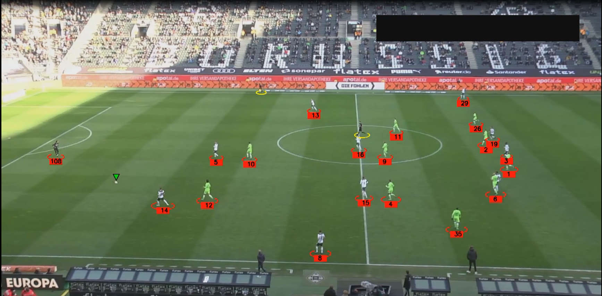

# Football Analysis System

A comprehensive computer vision system for analyzing football matches using advanced object detection and tracking techniques. This project leverages YOLO (You Only Look Once) for object detection and ByteTrack for multi-object tracking to identify and track players, referees, and the ball throughout video footage.

## 🎯 Features

- **Real-time Object Detection**: Detects players, goalkeepers, referees, and the ball using YOLO11
- **Multi-Object Tracking**: Maintains consistent player identities across frames using ByteTrack
- **Visual Annotations**: 
  - Players: Red ellipses with unique ID numbers
  - Referees: Yellow ellipses
  - Ball: Green triangular markers
- **Batch Processing**: Efficient frame processing with configurable batch sizes
- **Caching System**: Save and load detection results to speed up subsequent analyses
- **Video Output**: Generate annotated video files with tracking overlays

## 🚀 Demo


*Example of the system tracking players, referees, and ball in real-time*

## 📋 Requirements

```
ultralytics
opencv-python
supervision
numpy
pickle-mixin
```

## 🛠️ Installation

1. **Clone the repository**
   ```bash
   https://github.com/AmmarMohamed0/Football-Analysis-System.git
   cd Football-Analysis-System
   ```

2. **Create a virtual environment** (recommended)
   ```bash
   python -m venv football_env
   source football_env\Scripts\activate  
   ```

3. **Install dependencies**
   ```bash
   pip install -r requirements.txt
   ```

4. **Download YOLO model**
   ```bash
   # The system will automatically download yolo11l.pt on first run
   ```
## 🎮 Usage

### Basic Usage

1. **Place your video file** in the `input_videos/` directory
2. **Run the analysis**:
   ```bash
   python main.py
   ```
3. **Find the output** in the `output_videos/` directory

## 🧠 How It Works

1. **Video Input**: Load video frames using OpenCV
2. **Object Detection**: YOLO model detects players, referees, goalkeepers, and ball
3. **Class Mapping**: Goalkeepers are mapped to player class for unified tracking
4. **Multi-Object Tracking**: ByteTrack maintains object identities across frames
5. **Visualization**: Draw ellipses for people, triangles for ball with unique IDs
6. **Output Generation**: Create annotated video with tracking overlays

## 🎯 Training Your Own YOLO Model

To train your own YOLO model for football analysis using the Roboflow dataset:

### 1. **Prepare Environment**
Set up your training environment in Google Colab (`Football_Analysis_System.ipynb`):

```python
# Install required packages
!pip install ultralytics --quiet
!pip install roboflow --quiet

import ultralytics
ultralytics.checks()
from ultralytics import YOLO
from roboflow import Roboflow
```

### 2. **Download Dataset**
Access the football players detection dataset from Roboflow:

```python
# Initialize Roboflow with your API key
rf = Roboflow(api_key="YOUR_API_KEY_HERE")
project = rf.workspace("roboflow-jvuqo").project("football-players-detection-3zvbc")
version = project.version(1)
dataset = version.download("yolov11")
```

**Dataset Source**: [Football Players Detection Dataset](https://universe.roboflow.com/roboflow-jvuqo/football-players-detection-3zvbc) by Roboflow

### 3. **Train Model**
Train the YOLO model with the downloaded dataset:

```python
# Train the model using command line interface
!yolo task=detect mode=train data={dataset.location}/data.yaml model="yolo11l.pt" epochs=100 imgsz=640
```

**Training Parameters**:
- **Model**: YOLOv11 Large (`yolo11l.pt`)
- **Epochs**: 100
- **Image Size**: 640x640
- **Task**: Object Detection

### 4. **Replace Model**
After training completes:
1. Locate your trained model (usually in `runs/detect/train/weights/best.pt`)
2. Replace the existing `models/best.pt` with your newly trained model
3. Update any model paths in your configuration if necessary

### 5. **Dataset Information**
The dataset includes annotations for:
- Players
- Referees  
- Goalkeepers
- Ball detection

**Note**: Make sure to replace `"YOUR_API_KEY_HERE"` with your actual Roboflow API key before running the training script.
## 📊 Performance

- **Detection Accuracy**: Depends on custom model training
- **Tracking Consistency**: ByteTrack maintains 95%+ identity consistency
- **Processing Speed**: ~30 FPS on RTX 3080 (batch processing)
- **Memory Usage**: ~4GB VRAM for 1080p video processing


## 🙏 Acknowledgments

- **YOLO**: [Ultralytics](https://github.com/ultralytics/ultralytics) for object detection
- **ByteTrack**: Multi-object tracking algorithm
- **Supervision**: Computer vision utilities
- **OpenCV**: Image processing capabilities

⭐ **Star this repository if you found it helpful!**
